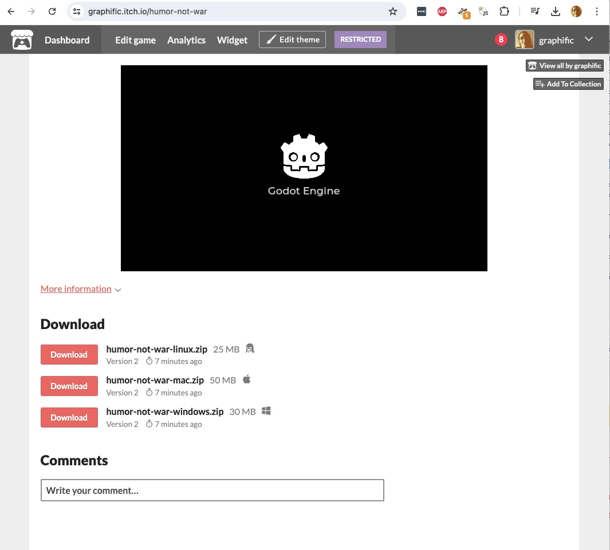

## Godot 4.3 Game jam template
Started from the 🤖 [Godot Engine 4.0 template](https://github.com/bitbrain/godot-gamejam) with minor fixes for web and mac

For details look there

 

- uses Godot version 4.3 beta 1 which exports to web using single threaded mode
- auto pushes web, mac, windows, and linux builds to your Itch.io page of choice

### _🚀 Automatic [itch.io](https://itch.io) deployment_

This templates comes with automatic deployment to itch.io for MacOS, Windows, Linux and HTML5 (Web). Delete `.github/workflows/godot-ci.yml` in case you are not interested in deploying to itch.io!

1. generate new API key in your itch.io settings and setup your `BUTLER_API_KEY` secret - [learn more](https://docs.github.com/en/actions/security-guides/using-secrets-in-github-actions)
2. create a new game on itch.io
3. setup `ITCHIO_GAME` and `ITCHIO_USERNAME` secrets in Github and assign them to your itch.io username and game name

- used for the [Games Transformed](https://itch.io/jam/gt24) game jam

